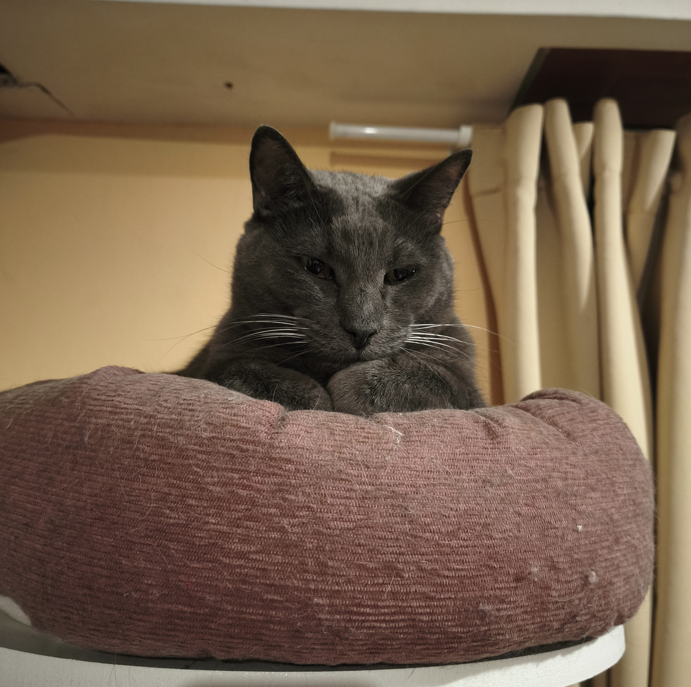

  

  
  
    Presentación Personal
  

<h2 style="font-family:'Trebuchet MS';">Datos personales</h2>

Mi nombre es Florencia A. Chiaramonte y estoy cursando en la Univ. Nacional de Hurlingham la Licenciatura en Desarrollo de
Videojuegos y Simulaciones. Trabajo en una empresa que brinda diversos servicios a otras compañías, como auditoría, asesoramiento legal, entre otros. Dentro de la organización formo parte del área de IT, donde desempeño el rol de Senior QA. Mis tareas incluyen revisar los desarrollos realizados por mis compañeros, analizar documentación del equipo general y realizar gestiones administrativas. Aunque en mi puesto actual no programo, todo lo que aprendo en la carrera me resulta valioso: me permite comprender mejor el trabajo de mis compañeros y potenciar mi desempeño en QA. Desde mi rol, me interesa contribuir a mantener y mejorar la calidad, buscando un equilibrio entre QA manual y automatización.

Actualmente vivo en Castelar junto con mis cinco gatos: Adolfo, Cleopatra, Kale, Minerva y Max (el de la imagen).

<h2 style="font-family:'Trebuchet MS', serif;">Otra Información</h2>
Este no es mi primer acercamiento a GitHub: lo utilicé hace algunos años en cursos, aunque agradezco volver a trabajar con la plataforma para actualizarme.

Además de la facultad, estoy estudiando inglés.
